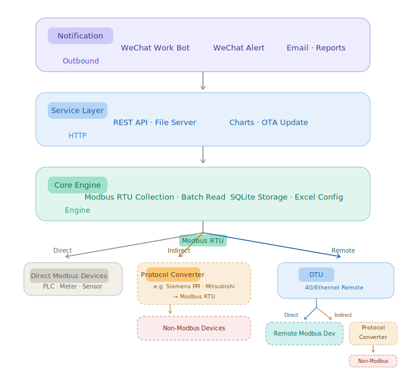

# one-modbus — Modbus RTU 数据采集网关

> 一个干了 30 年电工，不满意现有软件，边学 Go 边做出来的开源网关。
> 一个 .exe 搞定工业数据采集全链路，**替代组态王**。

传统工业数据采集需要三套独立系统：采集软件 + 可视化平台 + 报警开发。
**这一个 .exe 全包了。**

📥 **下载（国内快）**：[Gitee Release](https://gitee.com/dingjiazhi/one-modbus/releases)
🌐 **国际下载**：[GitHub Release](https://github.com/dingjiazhi/one-modbus/releases)

---

## 3 步上手

1. 下载 `modbusrtu_broker.exe`
2. 同级目录放 **项目变量信息.xlsx**（没有会自动生成模板）
3. 双击运行，浏览器打开 **http://127.0.0.1:53046/统计**

> 详细配置见 [docs/quick-start.md](docs/quick-start.md)

---

## 功能

| 功能 | 说明 |
|------|------|
| **多串口并发采集** | 每个串口独立 goroutine，互不阻塞 |
| **批量读取优化** | 同设备多变量合并为一条 Modbus 请求 |
| **零代码配置** | Excel 填变量表，双击即用 |
| **REST API** | 任意变量值可被第三方系统读取 |
| **SQLite 历史存储** | 自动记录历史数据，网页图表查询 |
| **微信报警** | 企业微信群机器人推送状态和报警 |
| **邮件报表** | 定时数据报表 + 即时报警邮件 |
| **远程升级** | 浏览器上传新版 exe，自动替换重启 |

---

## 远程采集（Internet + DTU）

不限本地串口。搭配 **99 元的 DTU（串口转 TCP 模块）** + 虚拟串口软件，采集千里之外的设备：

```
工厂A：254台电表 → RS-485总线 → DTU(¥99) → Internet ┐
工厂B：PLC         → RS-485总线 → DTU(¥99) → Internet ┼→ 虚拟串口软件 → one-modbus 网关
工厂C：传感器     → RS-485总线 → DTU(¥99) → Internet ┘  (TCP转COM)     (实时轮询)
```

- 1 个 DTU + 1 条 RS-485 总线 = 每站最多 **254 台设备**
- 1 台服务器最多 **254 个虚拟串口**
- 理论最大 **64,516 台设备** 同机采集
- 每台设备硬件成本不到 **0.4 元**

网关不管 COM 口在本地还是 100 公里外——它只管通过这个口读写 Modbus 数据。

---

## 兼容性

- **操作系统**：Windows 7/10/11/Server（需 COM 口权限）
- **协议**：Modbus RTU（RS-232/RS-485），功能码 1/2/3/4
- **设备**：PLC、智能电表、传感器、变频器、温控器——任何 Modbus RTU 设备

---

## 架构图



---

## 许可证

GNU Affero General Public License v3.0（AGPL-3.0）

修改本软件并通过网络向第三方提供服务的企业，**必须**公开修改后的完整源代码。
